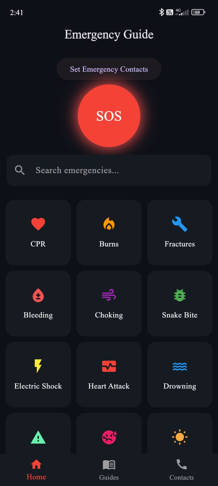
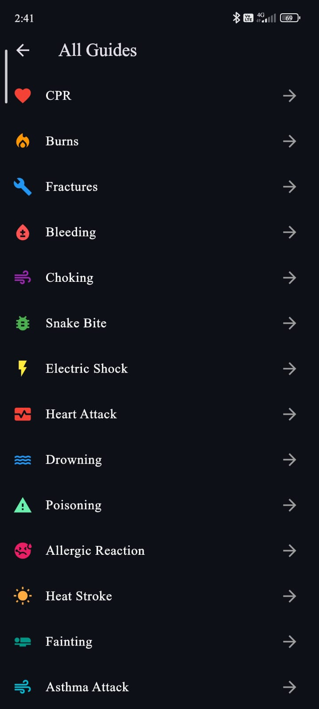
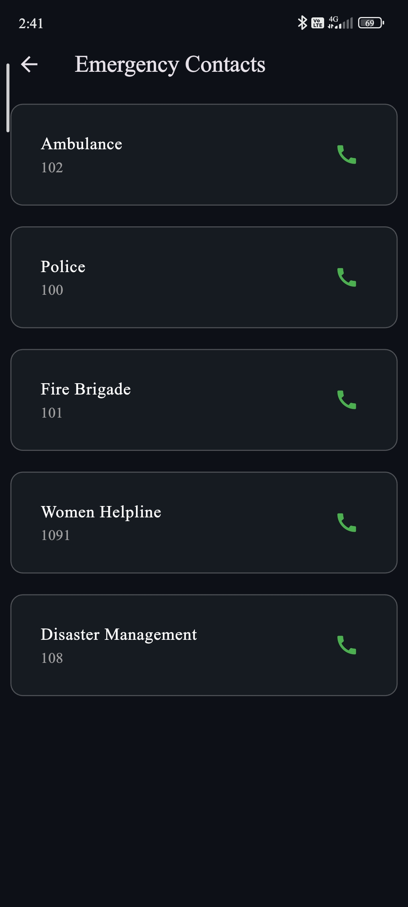

# 🚨 Rakshak-X (Emergency SOS Application)

Rakshak-X is a Flutter-based emergency response mobile application designed to provide instant help during critical situations. The app allows users to quickly contact emergency services and share their live location with trusted contacts using a simple and fast interface.

---

## 📱 Key Features
- 🚨 One-Tap Emergency Call
- 📍 Send SOS Message with Live Location
- ⚡ Fast and User-Friendly Interface
- 💾 Local Data Storage using SharedPreferences
- 🌍 Real-Time Location Access using Geolocator

---

## 🛠️ Tech Stack
- Flutter (Dart)
- Geolocator Plugin
- URL Launcher
- Shared Preferences

---

## 📦 APK Download
👉 Download the application from the **Releases Section** of this repository.

---

## 👥 Team Contribution

This project was developed as a collaborative team project.

### 👨‍💻 Mahesh Dalve
- Designed and developed SOS emergency feature
- Implemented calling and SMS functionality
- Integrated live location using Geolocator
- Developed core UI and app flow

### 👨‍💻 Smriti Mishra
- Worked on UI improvements and design
- Assisted in emergency guide module
- Helped in testing and debugging

---

## 🚀 Future Enhancements
- Live real-time tracking system
- Cloud database integration
- Voice-based SOS trigger
- Multi-contact emergency alerts

---

## 📸 Screenshots
### 🏠 Home Screen

### 🚨 SOS Screen

### 📍 Location Screen

### 📞 Contact Screen

---

## 📌 Conclusion
Rakshak-X focuses on improving personal safety by providing quick, reliable, and easy-to-use emergency support features.

---

## 🤝 Acknowledgment
This project highlights teamwork, problem-solving, and practical implementation of mobile development concepts using Flutter.
